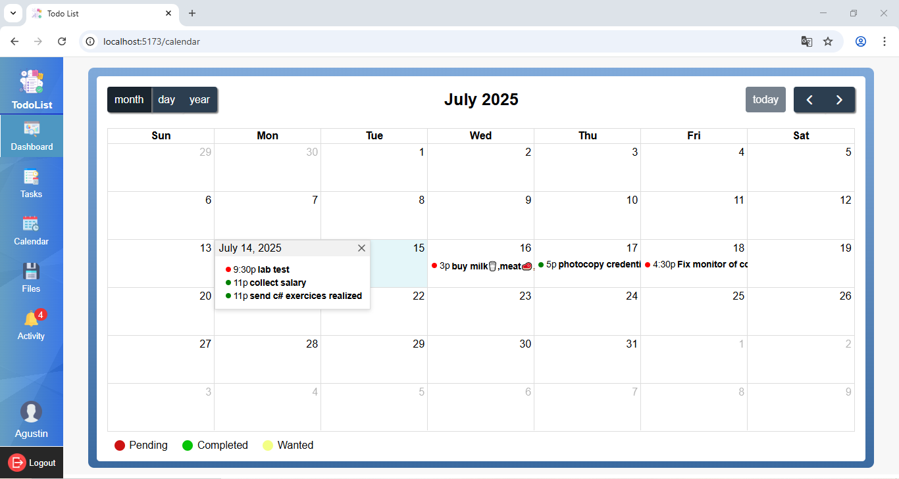

# TODO LIST REACT + NODEJS

> ## Instalacion frontend ⚙

#### Clonar repositorio

      git clone https://github.com/Agustin15/TodosList.git

#### Navegar hasta frontend:

      cd frontend

#### Instalar dependencias:

      npm install

> #### Iniciar la aplicacion

          npm run dev

          http://localhost:PORT/

- Ya podra acceder ingresando la url en su navegador

**_Dependencias:_**

- react
- react-dom
- react-spinners
- react-router
- canvasjs/react-charts
- react-doc-viewer
- fullcalendar/react
- fullcalendar/core
- fullcalendar/daygrid
- fullcalendar/timegrid
- fullcalendar/interaction
- fullcalendar/multimonth
- styled-components
  

**_Configuracion del proxy, archivo vite.config:_**

     server: {
    proxy: {
      "/api": {
        target: "http://localhost:PORT",
        changeOrigin: true,
        rewrite: (path) => path.replace(/^\/api/, "")
      }
    }
  }

**_Configuracion del archivo .env_**

    VITE_LOCALHOST_FRONT=http://localhost:PORT/
    
> ## Instalacion backend ⚙

**_Dirigirse a a la carpeta backEnd:_**

    cd backEnd

**_Instalar dependencias:_**

    npm install

**_Dependencias:_**

- express
- nodemon
- nodemail
- cookie-parser
- bcrypt
- multer
- dotenv
- mysql2

**_Configuracion del archivo .env_**

    PORT=3000
    DATABASE_HOST=###
    DATABASE_NAME=###
    DATABASE_USER=###
    DATABASE_PASSWORD=###
    JWT_SECRET_KEY=###
    JWT_SECRET_KEY_REFRESH=###
    USER_MAIL=###
    PASSWORD_APP_MAIL=###

> ## Iniciar ▶

**_Iniciar localhost watch live con nodemon_**

    npm run dev

**_Para iniciar localhost pero sin watch live con node_**

    npm run start

### Login

### Dashboard

### List tasks filtered

### Calendar 

### Details task 

