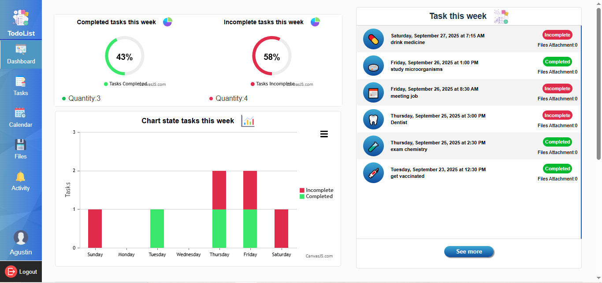
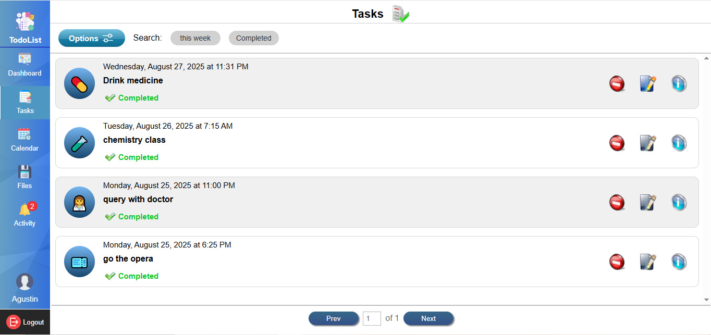
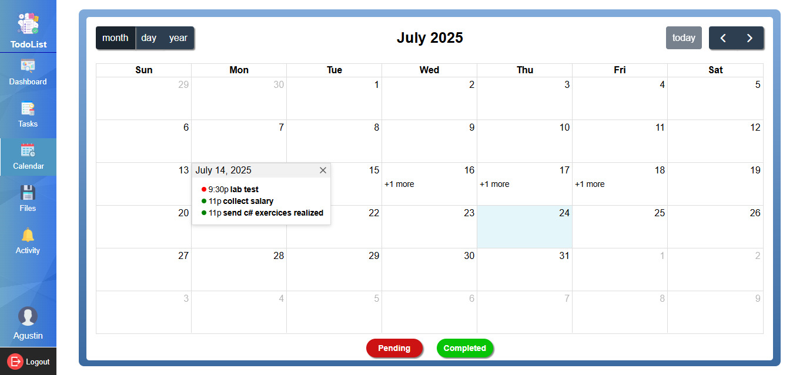

# TODOLIST 

> ## Instalacion frontend ⚙

#### Clonar repositorio

      git clone https://github.com/Agustin15/TodosList.git

#### Navegar hasta frontend:

      cd frontend

#### Instalar dependencias:

      npm install

> #### Iniciar la aplicacion

          npm run dev

          http://localhost:PORT/

- Ya podra acceder ingresando la url en su navegador

**_Dependencias:_**

- react
- [react-dom](https://github-com.translate.goog/facebook/react?_x_tr_sl=en&_x_tr_tl=es&_x_tr_hl=es&_x_tr_pto=tc)
- [react-router](https://github.com/remix-run/react-router)
- [canvasjs/react-charts](https://canvasjs.com/react-charts/)
- [react-doc-viewer](https://github.com/cyntler/react-doc-viewer)
- [fullcalendar/react](https://fullcalendar.io/docs/react)
- [fullcalendar/core](https://fullcalendar.io/docs/react)
- [fullcalendar/daygrid](https://fullcalendar.io/docs/react)
- [fullcalendar/timegrid](https://fullcalendar.io/docs/react)
- [fullcalendar/interaction](https://fullcalendar.io/docs/react)
- [fullcalendar/multimonth](https://fullcalendar.io/docs/react)
- [styled-components](https://github.com/styled-components/styled-components)
- [sweetalert2](https://sweetalert2.github.io/)

**_Configuracion del proxy, archivo vite.config:_**

     server: {
    proxy: {
      "/api": {
        target: "http://localhost:PORT",
        changeOrigin: true,
        rewrite: (path) => path.replace(/^\/api/, "")
      }
    }

}

**_Configuracion del archivo .env_**

    VITE_LOCALHOST_FRONT=http://localhost:PORT/
    VITE_APPLICATION_SERVER=<MyVapidPublicKeyGenerate https://vapidkeys.com/>

> ## Instalacion backend ⚙

**_Dirigirse a a la carpeta backEnd:_**

    cd backEnd

**_Instalar dependencias:_**

    npm install

**_Dependencias:_**

- [express](https://github.com/expressjs/express)
- [nodemon](https://github.com/remy/nodemon)
- [nodemail](https://github.com/nomospace/nodemail)
- [cookie-parser](https://github.com/expressjs/cookie-parser)
- [bcrypt](https://github.com/kelektiv/node.bcrypt.js)
- [multer](https://github.com/expressjs/multer)
- [dotenv](https://github.com/motdotla/dotenv)
- [mysql2](https://sidorares.github.io/node-mysql2/docs)
- [webpush](https://github-com.translate.goog/web-push-libs/web-push?_x_tr_sl=en&_x_tr_tl=es&_x_tr_hl=es&_x_tr_pto=tc#readme)
- [bullmq](https://docs.bullmq.io/)
- [socket.io](https://github.com/socketio/socket.io)

**_Configuracion del archivo .env_**

    PORT=<My Port of Backend>
    DATABASE_HOST=<My Localhost Database>
    DATABASE_NAME=<My Database Name>
    DATABASE_USER=<My Database User>
    DATABASE_PASSWORD=<My Password Database>
    JWT_SECRET_KEY=<My JWT Secret Key>
    JWT_SECRET_KEY_REFRESH=<My JWT Secret Key>
    USER_MAIL=<My Mail From Send Email With Nodemail>
    PASSWORD_APP_MAIL=<My Password App Mail>
    PORT_REDIS=<My Port of Redis server>
    VAPID_PRIVATE_KEY=<My Vapid Private Key Generate in https://vapidkeys.com/>
    VAPID_PUBLIC_KEY=<Same My Vapid Public Key of Frontend env>
    MAILTO_EMAIL_NOTIFICATION_SERVER=<My MailtoEmail in https://vapidkeys.com/ >
    LOCALHOST_URL_FRONT=<My localhost frontend>

> ### Instalar servidor Redis usando docker

**_Buscar imagen redis_**

    docker search redis

**_Descargar la primera imagen_**

    docker pull redis

**_Iniciar contenedor con imagen_**

    docker run --name myRedis -d -p <port>:<port> redis:latest redis-server --requirepass <password>

> ## Iniciar ▶

**_Iniciar localhost watch live con nodemon_**

    npm run dev

**_Para iniciar localhost pero sin watch live con node_**

    npm run start

### Login

### Dashboard

### List tasks pending

### List tasks completed

### Calendar

### Files

### Notifications

